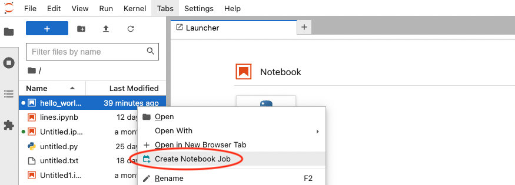
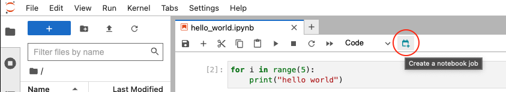
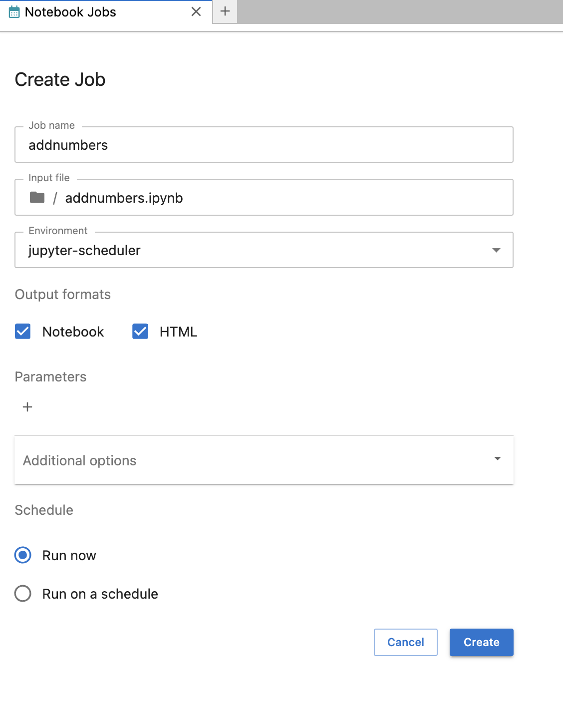
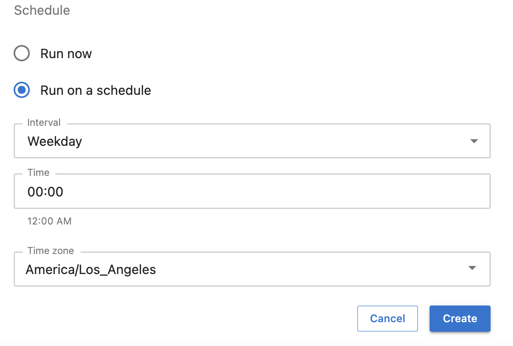
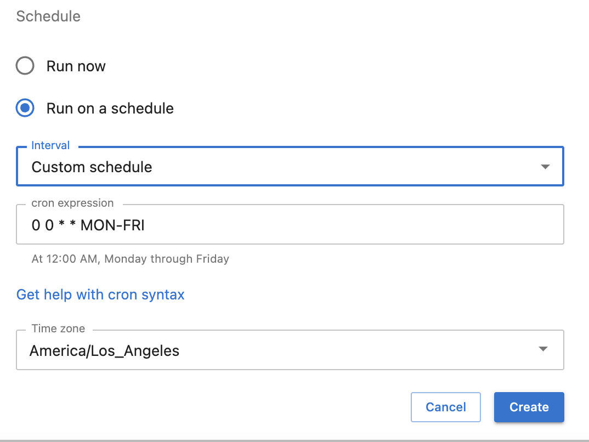

# Users

These pages are for people interested in installing and using Jupyter Scheduler.

For configuration options, please refer to our {doc}`operator's guide </operators/index>`.

## Installation

Jupyter Scheduler can be installed from the PyPI registry via `pip`:

```
pip install jupyter-scheduler
```

This automatically enables its extensions. You can verify this by running

```
jupyter server extension list
jupyter labextension list
```

and checking that both the `jupyter_scheduler` server extension and the
`@jupyterlab/scheduler` prebuilt lab extension are enabled.

## Use

Jupyter Scheduler can run your Jupyter notebooks in the background once or on a schedule. You can create *jobs* (single run of an individual notebook) and *job definitions* (scheduled recurring notebook jobs).

### Creating a job or job definition

1. Choose a Jupyter notebook
   - To create a *job* or *job definition* from a file browser, right-click on a notebook in the file browser and choose “Create Notebook Job” from the context menu:


   - To create a *job* or *job definition* from an open Notebook, click on a “Create a notebook job” button in the top toolbar of the open Notebook


2. Fill out Create Job form

   You can give your notebook job or job definition a name, choose an environment to run it in, select different output formats, and provide parameters that are set as local variables when your notebook gets executed. This parameterized execution is similar to [Papermill](https://papermill.readthedocs.io/en/latest/); Jupyter Scheduler provides a UI for managing and accessing the outputs of your notebook jobs inside JupyterLab.
   
   - To create a *job*, press "Create" button when "Run Now" is chosen under "Schedule".
   

   - To create a *job definition* that would run your job on a recurring schedule select “Run on a schedule” radio button in "Schedule" section. We provide a few useful shortcuts to, for example, run your notebook at a specified minute, hour, daily or weekly interval.
   
   You can also specify a custom schedule in [crontab format](https://www.man7.org/linux/man-pages/man5/crontab.5.html) by selecting "Custom schedule" in "Interval" drop-down menu.
   

### Using list view

### Using details view
