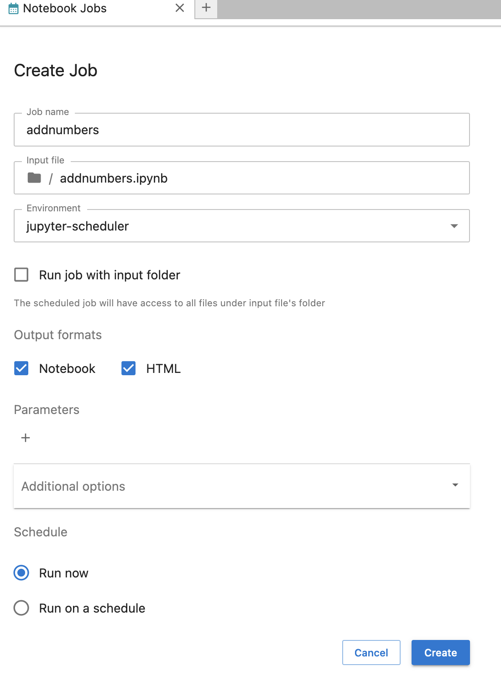
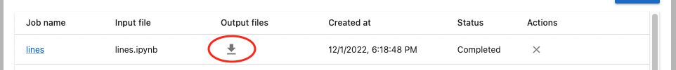

# Users

These pages are for people interested in installing and using Jupyter Scheduler.

For configuration options, please refer to our {doc}`operator's guide </operators/index>`.

## Installation

Jupyter Scheduler can be installed from the PyPI registry via `pip`:

```
pip install jupyter-scheduler
```

This automatically enables its extensions. You can verify this by running

```
jupyter server extension list
jupyter labextension list
```

and checking that both the `jupyter_scheduler` server extension and the
`@jupyterlab/scheduler` prebuilt lab extension are enabled.

## Use

Jupyter Scheduler runs Jupyter notebooks in the background, either once or on a schedule. You can create *jobs* (single run of an individual notebook) and *job definitions* (scheduled recurring notebook jobs). When the scheduler runs your notebook, it makes a copy of the input file. The scheduler uses unique names for the input and output files so that rerunning the same notebook produces new files every time.

### Creating a job or job definition

#### Choose a notebook
   - To create a *job* or *job definition* from a file browser, right-click on a notebook in the file browser and choose “Create Notebook Job” from the context menu:


   - To create a *job* or *job definition* from an open notebook, click on a “Create a notebook job” button in the top toolbar of the open notebook:


#### Submit the Create Job form

Give your notebook job or job definition a name, choose an environment to run it in, select its output formats, and provide parameters that are set as local variables when your notebook gets executed. This parameterized execution is similar to the one used in [Papermill](https://papermill.readthedocs.io/en/latest/).

   - To create a *job*, select "Run now" in the "Schedule" section, and click "Create".
   

   - To create a *job definition* that runs repeatedly on a schedule, select "Run on a schedule" in the "Schedule" section. You can use shortcuts to, for example, run your notebook every hour or every day.
   
   You can also specify a custom schedule in [crontab format](https://www.man7.org/linux/man-pages/man5/crontab.5.html) by selecting "Custom schedule" in the "Interval" drop-down menu.
   

### Using list view

Once you've created a job or job schedule, you can use the "Notebook Jobs" icon in the launcher to view lists of jobs and job definitions.


Each item's name links to a detail view.


You can sort the list by clicking one of the headers (for example, click "Job name" header to sort the list alphabetically based on "Job Name").


You can also delete each job or pause its execution in the list by clicking appropriate buttons in "Actions" column.


When one of your jobs has completed, you can download its files by clicking "Download job files" button in "Ouput files" column.



After download is finished, you can access the downloaded files through links that appear instead of "Download job files" button in "Output files" column.


### Details view

You can click job or job definition name in the list view to see its details.

#### Job detail

The job detail page displays information about one job. It includes action buttons to reload the detail view, stop the job (if it's in progress), download output files (if it's finished), and delete a job.


#### Job definition detail

The job definition detail page displays information about one job definition. It includes action buttons to reload, pause, resume, edit, and delete the job definition. It also includes a list of jobs created by this job definition.

You can run a new job based on the input file snapshot by clicking the "Run Job" button on top of the detail view.


