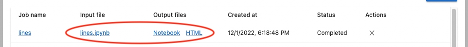
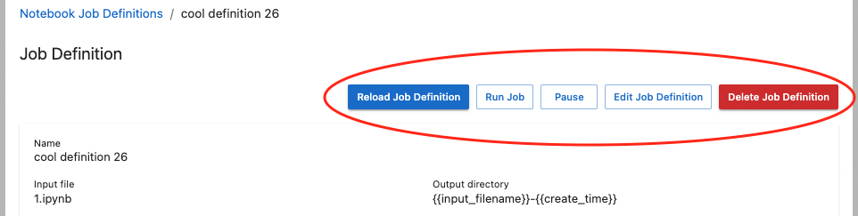

# Users

These pages are for people interested in installing and using Jupyter Scheduler.

For configuration options, please refer to our {doc}`operator's guide </operators/index>`.

## Installation

Jupyter Scheduler has a lab (client) extension and a server extension. **Both are required** to
be able to schedule and run notebooks. If you install Jupyter Scheduler via the JupyterLab
extension manager, you might only install the client extension and not the server extension.

**Recommended:** Install Jupyter Scheduler from the PyPI registry via `pip`:

```
pip install jupyter_scheduler
```

This automatically enables the lab and server extensions. You can verify this by running

```
jupyter server extension list
jupyter labextension list
```

and checking that both the `jupyter_scheduler` server extension and the
`@jupyterlab/scheduler` prebuilt lab extension are enabled.

## Use

Jupyter Scheduler runs Jupyter notebooks in the background, either once or on a schedule. You can create _jobs_ (single run of an individual notebook) and _job definitions_ (scheduled recurring notebook jobs). When the scheduler runs your notebook, it makes a copy of the input file. The scheduler uses unique names for the input and output files so that rerunning the same notebook produces new files every time.

### Creating a job or job definition

#### Choose a notebook

To create a _job_ or _job definition_ from a file browser, right-click on a notebook in the file browser and choose “Create Notebook Job” from the context menu:


To create a _job_ or _job definition_ from an open notebook, click on a “Create a notebook job” button in the top toolbar of the open notebook:


#### Submit the Create Job form

Give your notebook job or job definition a name, choose an environment to run it in, select its output formats, and provide parameters that are set as local variables when your notebook gets executed. This parameterized execution is similar to the one used in [Papermill](https://papermill.readthedocs.io/en/latest/).

To create a _job_ that runs once, select "Run now" in the "Schedule" section, and click "Create".


To create a _job definition_ that runs repeatedly on a schedule, select "Run on a schedule" in the "Schedule" section. You can use shortcuts to, for example, run your notebook every hour or every day.


You can also specify a custom schedule in [crontab format](https://www.man7.org/linux/man-pages/man5/crontab.5.html) by selecting "Custom schedule" in the "Interval" drop-down menu.


### Using list view

Once you've created a job or job schedule, you can use the "Notebook Jobs" icon in the launcher to view lists of jobs and job definitions.


Each item's name links to a detail view.


You can sort the list by clicking one of the headers (for example, click the "Job name" header to sort the list alphabetically based on "Job Name").


You can also delete each job or stop a running job by clicking the buttons in the "Actions" column. The job definitions list also has a button to pause and resume a job definition. Paused job definitions do not start jobs.


When one of your jobs has completed, you can download its input and output files by clicking the "Download job files" button in the "Output files" column.


After clicking the download button, links to files appear in the "Input file" and "Output files" columns.



### Details view

You can click the job or job definition name in the list view to see details.

#### Job detail

The job detail page displays information about one job. It includes action buttons to reload the detail view, stop the job (if it's in progress), download output files (if it's finished), and delete a job.


#### Job definition detail

The job definition detail page displays information about one job definition. It includes action buttons to reload, pause, resume, edit, and delete the job definition. It also includes a list of jobs created by this job definition.

You can run a new job based on the input file snapshot by clicking the "Run Job" button on top of the detail view.


